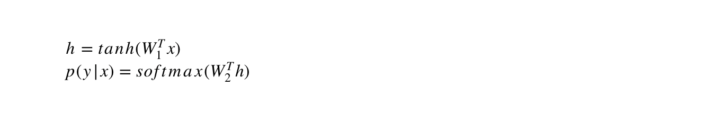

# Middle-English-Language-Model
Middle English was the form of English spoken and written after the conquest of the Normans until the late fifteenth century. The Canterbury Tales is a book written during this period by Geoffrey Chaucer. This project is a demonstration of a language model in Middle English based on this book.

- `web_scrape.py` stores the raw text into `text.txt`.

- `train.py` cleans and preprocesses the text, makes a neural network model entirely in numpy, stores the weight matrices and the word index mapping in `chaucer_model`, and trains it on the text.

- `test.py` builds a sequence of following words based on the cosine distance with the input word.

### Neural Network Model:
The neural network used has one hidden layer with 100 nodes. This creates a bottleneck in the neural network architecture and reduces the number of parameters. The input and output layers have nodes equal to the vocabulary size.

The cost minimisation is done using stochastic gradient descent.

The training goes on for 5 epochs after which the cost more or less converges to the optimum value.
### Demonstration
`cd` into the directory and type `python test.py` to run the program.

